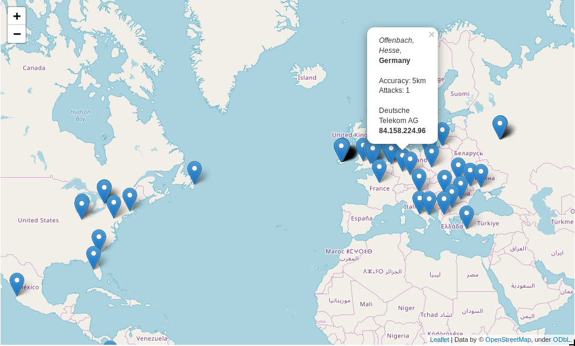

# ip

## Features:
- Parses Cowrie honeypot JSON logs into SQLite at `20,000+
  insertions/sec`, while adding geolocation data from MaxMind.
  - Gets the following information on honeypot attackers:
    - Continent, Country, Region, City names as well as ISO codes
    - Latitude, Longitude, Postal Code and Accuracy Radius
    - Activity (login success/fail, logout)
    - Timezone
    - Internet Service Provider (ISP)
    - Log of all access timestamps, as well as timestamp for first and last attacker sightings
    - Number of attacks from an IP on the honeypot
- Exposes all SQLite data as a Pandas/GeoPandas dataframe, which can be directly manipulated and visualized in the included Jupyter Notebook
- Low memory consumption 

## Requirements
- System packages:
  `libgeos-dev`, `libgdal-dev`, `libproj-dev`
- For Python requirements see `requirements.txt`

## To-Do:
- Extract and analyze data based on timeframes
  - Get the number of attacks/day, attacks/month, etc 
  - Get the average frequency of attacks for a timeframe
    (every minute, twice a day, etc)
