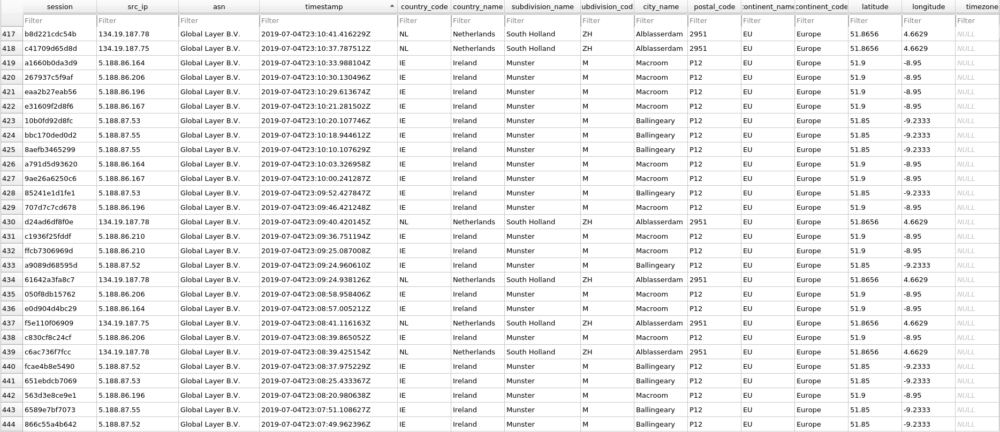

# ip: (the) i(nternet is) p(robably down)

_Geographical visualization of attacker data_

_Sample of the SQLite database contents_

_Example chart visualization in the included Jupyter notebook_

## Features:
- Parses Cowrie honeypot JSON logs into SQLite at `20,000+
  insertions/sec`, while adding geolocation data from MaxMind.
  - Gets the following information on honeypot attackers:
    - Continent, Country, Region, City names as well as ISO codes
    - Latitude, Longitude, Postal Code and Accuracy Radius
    - Activity (login success/fail, logout)
    - Timezone
    - Internet Service Provider (ISP)
    - Log of all access timestamps, as well as timestamp for first and last attacker sightings
    - Number of attacks from an IP on the honeypot
- Exposes all SQLite data as a Pandas/GeoPandas dataframe, which can be directly manipulated and visualized in the included Jupyter Notebook
- Low memory consumption 

## Structural Overview

## Requirements
- System packages:
  `libgeos-dev`, `libgdal-dev`, `libproj-dev`
- For Python requirements see `requirements.txt`
- GeoLite2 City and ASN MMDB files in the root directory of the project, freely downloadable [here](https://dev.maxmind.com/geoip/geoip2/geolite2/)

## Data Size:
One days worth of Cowrie JSON logs are 60MB on average. This means that if the honeypot is running 24/7, 
you'll end up collecting about 20-30GB of raw log data _per_ honeypot a year. The
SQLite database however, turns a 60-80MB daily log into roughly 1MB of
processed data. So the SQLite database of processed data will yield roughly
365MB a year.

Extrapolating this out to a honeynet containing 5 sensors, operated over 3 years:
- Daily log yield: `~300MB`
- Yearly log yield: `~100GB`
- Total log yield: `~300GB`
- Total SQlite yield: `~1GB`

Naturally, the solution becomes to squish all of the raw data in tar archives,
and put those somewhere where they aren't taking up precious space. With a
simple 'tar zcvf' I was able to achieve better results:

- 5 days of logs from one sensor (compressed): `~30MB`

## Usage
- Create a virtualenv with `requirements.txt` packages installed
- Run `python log_digester.py`, which will use the sample data provided in the repo
- Run `jupyter notebook` to view the data visualizations

## To-Do:
- Write a Prometheus exporter
  - [Article](https://medium.com/@ikod/custom-exporter-with-prometheus-b1c23cb24e7a)
  - [Example](https://github.com/MUNComputerScienceSociety/Automata/blob/master/plugins/Analytics/__init__.py)
  - [Article 2](https://www.robustperception.io/productive-prometheus-python-parsing)
  - [Article 3](https://www.robustperception.io/writing-a-jenkins-exporter-in-python)
  
- Extract and analyze data based on timeframes
  - Get the number of attacks/day, attacks/month, etc 
    - How do we determine the number of attacks for a given day?
      - Need to normalize the timestamps first
  - Get the average frequency of attacks for a timeframe
    (every minute, twice a day, etc)
